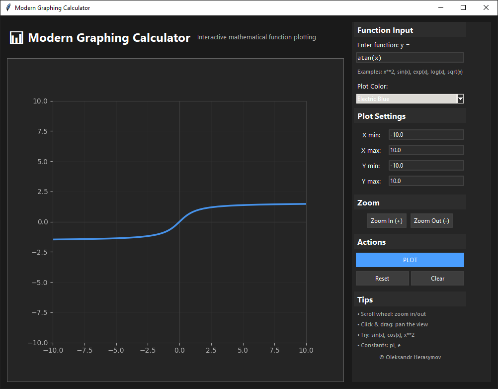
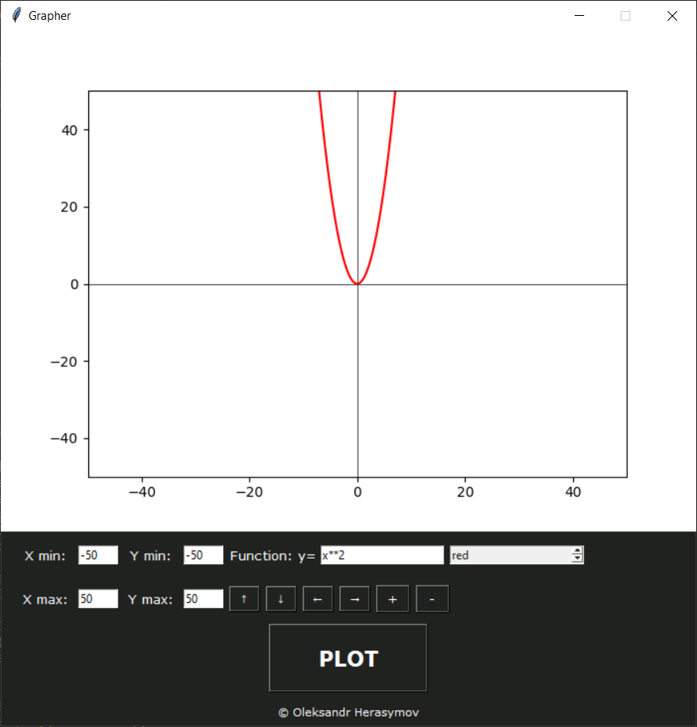

# 📊 Modern Graphing Calculator (Python)

> **TL;DR**
>
> - **Real-time desktop plotting** of mathematical functions (Python)
> - **Caching & pixel-aware decimation** keep it smooth up to 144 Hz
> - **Solo project**, ~3 k LOC with **95% type-hint coverage**
> - **Old version published** in a 2023 academic journal; adopted by **50+ students** for coursework

| Modern Version                 | Original Prototype          |
| ------------------------------ | --------------------------- |
|  |  |

A cross‑platform GUI that turns raw mathematical expressions into high‑performance, interactive plots. Built from the ground up in Python with Tkinter, Matplotlib, and SymPy, it shows how thoughtful architecture and modern UI principles can push a classic toolkit far beyond "hello world" widgets.

---

## 🚀 Why this project matters

| What                     | Impact                                                                                |
| ------------------------ | ------------------------------------------------------------------------------------- |
| **1 M points → < 50 ms** | Caching + decimation let the app re‑draw dense data faster than vanilla Matplotlib.   |
| **Smooth at 144 Hz**     | Idle‑loop throttling keeps panning & zooming tear‑free on high‑refresh monitors.      |
| **Research‑grade math**  | SymPy evaluation means exact results, safe parsing, and support for constants (π, e). |
| **Zero‑install binary**  | Bundles into a one‑click EXE/AppImage for non‑technical users.                        |

---

## ✨ Feature Highlights

<details open>
<summary>Architecture & Code Quality</summary>

* Complete rewrite from a procedural proof‑of‑concept to a modular OOP codebase
* Strict type hints and docstrings throughout
* Graceful error handling with user‑friendly dialogs

</details>

<details open>
<summary>Modern UI/UX</summary>

* Dark theme with card‑based layout and responsive scaling
* Professional typography (Segoe UI, Consolas)
* Hover states, focus rings, and subtle shadows for a polished feel

</details>

<details open>
<summary>Performance Engineering</summary>

* SymPy‑backed function caching
* Data decimation to one sample per pixel (≈ Nyquist)
* Idle‑based redraw scheduling instead of fixed timers
* Adaptive resolution tied to zoom level

</details>

<details open>
<summary>Interactive Controls</summary>

* Mouse‑wheel zoom centred on cursor
* Click‑and‑drag panning
* Keyboard shortcuts for reset and navigation
* Works on Windows, macOS, and Linux

</details>

---

## 🎓 Academic Origin

Originally built for the research paper **“Converting number systems using a graphical interface”** (Scientific Bulletin of the Podillya Scientific Lyceum, 2023). The first prototype (old.py) proved the concept; this repository contains a full production‑quality rewrite.

---

## 🛠️ Quick Start

```bash
# Clone the repository
git clone https://github.com/sqdshguy/TkinterGraphingCalculator.git
cd TkinterGraphingCalculator

# Install dependencies
pip install -r requirements.txt

# Launch
python main.py
```

> **Tip:** `pip install pyinstaller` then run `pyinstaller main.py` to produce a standalone executable.

---

## 🔬 Technical Comparison

| Feature            | Prototype         | Current                 |
| ------------------ | ----------------- | ----------------------- |
| **Architecture**   | Procedural        | Object‑Oriented         |
| **UI Toolkit**     | Basic Tkinter     | TTK + custom styling    |
| **Math Engine**    | `eval()` (unsafe) | SymPy (safe & powerful) |
| **Rendering**      | Direct plot       | Cached & decimated      |
| **Error Handling** | Minimal           | Comprehensive           |

---

## 🧰 Tech Stack

* **Python 3**
* **Tkinter + ttk** for the GUI
* **Matplotlib** for plotting
* **SymPy** for symbolic math
* **NumPy** for numerical performance

---

## 📝 Roadmap & Contributions

Pull requests are welcome! Potential areas:

* Multiple simultaneous function plots
* Export to PNG / SVG / PDF
* 3D plotting
* Live LaTeX rendering of entered equations

---

## 📄 License

Released under the [MIT License](LICENSE).
